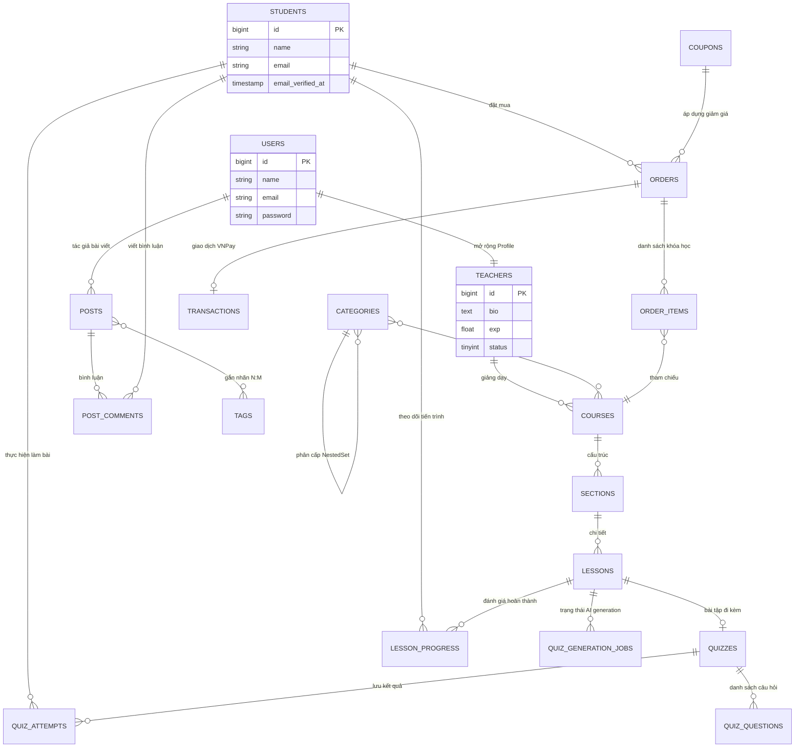
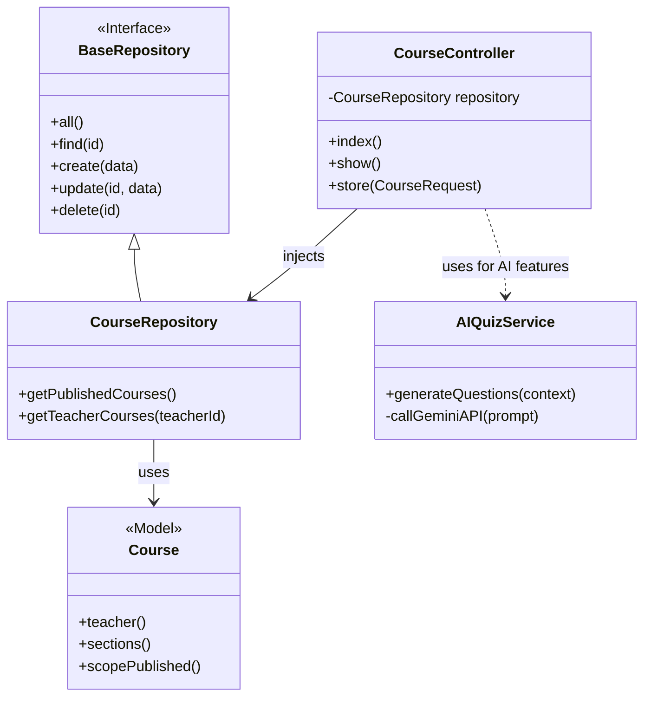
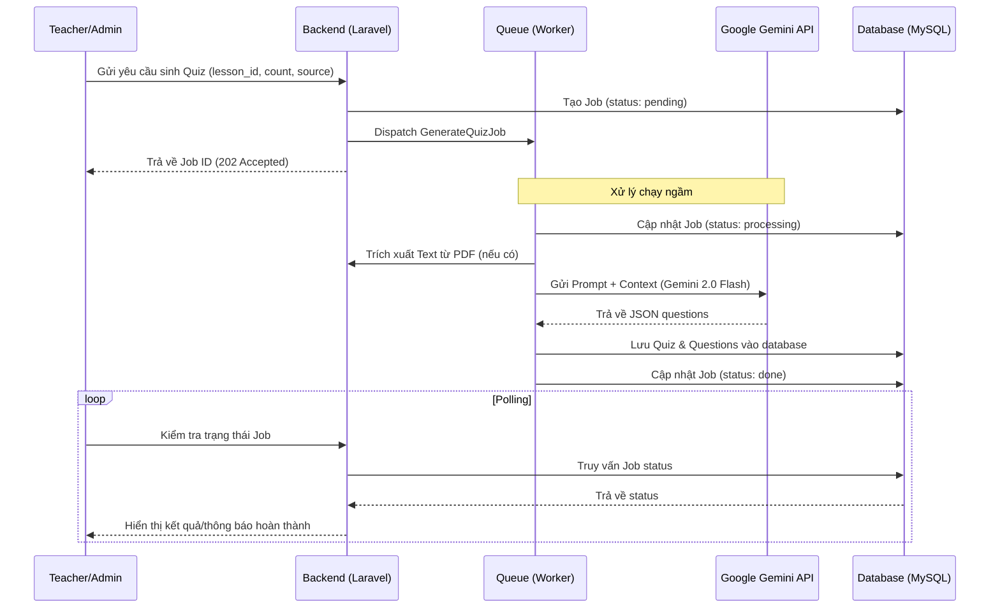

# Thiết kế Hệ thống E-Learning Marketplace (Mermaid Diagrams)

Tài liệu này chứa các sơ đồ thiết kế hệ thống được vẽ bằng Mermaid, phục vụ cho báo cáo đồ án.

---

## 1. Sơ đồ Use Case tổng thể

Sơ đồ này mô tả các tác nhân và các chức năng chính, được trình bày dưới dạng Flowchart để đảm bảo hiển thị tốt nhất trên mọi trình xem Markdown.

```mermaid
graph LR
    %% Actors
    subgraph Actors
        Student[("Học viên (Student)")]
        Teacher[("Giảng viên (Teacher)")]
        Admin[("Quản trị viên (Admin)")]
    end

    %% Use Cases
    subgraph UC_Student ["Phân hệ Học viên"]
        UC1(["Đăng ký/Đăng nhập"])
        UC2(["Tìm kiếm & Xem khóa học"])
        UC3(["Thanh toán khóa học (VNPay)"])
        UC4(["Học bài & Theo dõi tiến độ"])
        UC5(["Làm bài Quiz đánh giá"])
    end

    subgraph UC_Teacher ["Phân hệ Giảng viên"]
        UC6(["Quản lý Khóa học cá nhân"])
        UC7(["Tạo bài giảng & Tài liệu"])
        UC8(["Sinh Quiz tự động (AI Gemini)"])
        UC9(["Thống kê doanh thu cá nhân"])
    end

    subgraph UC_Admin ["Phân hệ Quản trị"]
        UC10(["Quản lý User & Phân quyền"])
        UC11(["Kiểm duyệt toàn bộ nội dung"])
        UC12(["Quản lý Danh mục & Bài viết"])
        UC13(["Quản lý Coupon & Order"])
    end

    %% Relationships
    Student --- UC1
    Student --- UC2
    Student --- UC3
    Student --- UC4
    Student --- UC5

    Teacher --- UC1
    Teacher --- UC6
    Teacher --- UC7
    Teacher --- UC8
    Teacher --- UC9

    Admin --- UC1
    Admin --- UC10
    Admin --- UC11
    Admin --- UC12
    Admin --- UC13

    %% Cross-actor rights
    UC11 -.-> UC6 : "Admin can edit any course"
```

---

## 2. Sơ đồ Thực thể Liên kết (ERD Toàn diện)

Sơ đồ ERD bao quát toàn bộ 27 bảng, tập trung vào các mối quan hệ logic quan trọng nhất giữa các phân hệ.



---

## 3. Kiến trúc Modular Monolith (Class Diagram)

Mô hình hóa cách các Module tương tác thông qua Repository Pattern.



---

## 4. Luồng AI Quiz Generation (Sequence Diagram)

Sơ đồ mô tả quy trình xử lý bất đồng bộ khi sinh câu hỏi bằng Gemini AI.


