# Class Diagrams & ER Diagrams Documentation Plan

> **For agentic workers:** REQUIRED SUB-SKILL: Use superpowers:subagent-driven-development (recommended) or superpowers:executing-plans to implement this plan task-by-task. Steps use checkbox (`- [ ]`) syntax for tracking.

**Goal:** Tạo tài liệu Sơ đồ lớp (Class Diagram) và Biểu đồ quan hệ (ERD) cho toàn bộ hệ thống e-learning, phục vụ luận văn tốt nghiệp.

**Architecture:** 13 task — 1 task setup, 6 task ERD (5 domain + 1 full), 6 task Class Diagram (5 domain + 1 full). Mỗi task tạo một file Markdown độc lập chứa Mermaid diagram. Domain chia theo: Auth/Users, Course/Learning, Quiz, Payment, Content/Posts.

**Tech Stack:** Mermaid (erDiagram + classDiagram), Markdown, có thể export sang PNG qua mermaid.live hoặc VS Code extension.

---

## Cấu trúc Files

| File | Nội dung |
|------|----------|
| `docs/diagrams/README.md` | Index tất cả sơ đồ |
| `docs/diagrams/erd-auth.md` | ERD: users, students, teachers, tokens, roles, permissions |
| `docs/diagrams/erd-course-learning.md` | ERD: courses, categories, sections, lessons, lesson_progress, media_files |
| `docs/diagrams/erd-quiz.md` | ERD: quizzes, quiz_questions, quiz_attempts, quiz_generation_jobs |
| `docs/diagrams/erd-payment.md` | ERD: orders, order_items, transactions, coupons |
| `docs/diagrams/erd-content.md` | ERD: posts, post_categories, tags, post_tag, post_comments |
| `docs/diagrams/erd-full.md` | ERD tổng hợp toàn bộ hệ thống |
| `docs/diagrams/class-auth.md` | Class Diagram: User, Student, Teachers + auth traits |
| `docs/diagrams/class-course-learning.md` | Class Diagram: Course, Category, Section, Lesson, LessonProgress, MediaFile |
| `docs/diagrams/class-quiz.md` | Class Diagram: Quiz, QuizQuestion, QuizAttempt, QuizGenerationJob |
| `docs/diagrams/class-payment.md` | Class Diagram: Order, OrderItem, Transaction, Coupon |
| `docs/diagrams/class-content.md` | Class Diagram: Post, PostCategory, Tag, PostComment |
| `docs/diagrams/class-full.md` | Class Diagram tổng hợp toàn bộ |

---

## Task 1: Setup — Tạo thư mục và file README index

**Files:**
- Create: `docs/diagrams/README.md`

- [ ] **Bước 1: Tạo file README index**

Tạo file `docs/diagrams/README.md` với nội dung sau:

```markdown
# Tài liệu Sơ đồ Hệ thống E-Learning

## Biểu đồ Quan hệ (ERD)

| Sơ đồ | Mô tả | Link |
|-------|-------|------|
| Auth & Users | users, students, teachers, roles, permissions | [erd-auth.md](./erd-auth.md) |
| Course & Learning | courses, categories, sections, lessons, progress | [erd-course-learning.md](./erd-course-learning.md) |
| Quiz | quizzes, questions, attempts, AI jobs | [erd-quiz.md](./erd-quiz.md) |
| Payment | orders, items, transactions, coupons | [erd-payment.md](./erd-payment.md) |
| Content/Posts | posts, categories, tags, comments | [erd-content.md](./erd-content.md) |
| **Full ERD** | Toàn bộ hệ thống | [erd-full.md](./erd-full.md) |

## Sơ đồ Lớp (Class Diagram)

| Sơ đồ | Mô tả | Link |
|-------|-------|------|
| Auth & Users | User, Student, Teachers | [class-auth.md](./class-auth.md) |
| Course & Learning | Course, Category, Section, Lesson, MediaFile | [class-course-learning.md](./class-course-learning.md) |
| Quiz | Quiz, QuizQuestion, QuizAttempt | [class-quiz.md](./class-quiz.md) |
| Payment | Order, OrderItem, Transaction, Coupon | [class-payment.md](./class-payment.md) |
| Content/Posts | Post, PostCategory, Tag, PostComment | [class-content.md](./class-content.md) |
| **Full Class Diagram** | Toàn bộ hệ thống | [class-full.md](./class-full.md) |

## Hướng dẫn render

- **GitHub/GitLab**: Tự động render Mermaid trong Markdown
- **VS Code**: Cài extension "Markdown Preview Mermaid Support"
- **Export PNG**: Dán code vào [mermaid.live](https://mermaid.live) → Download SVG/PNG
- **PlantUML alternative**: Dùng [plantuml.com](https://plantuml.com) nếu cần UML chuẩn hơn
```

- [ ] **Bước 2: Commit**

```bash
git add docs/diagrams/README.md
git commit -m "docs: add diagrams directory with README index"
```

---

## Task 2: ERD — Auth & Users Domain

**Files:**
- Create: `docs/diagrams/erd-auth.md`

**Bảng trong domain này:** `users`, `students`, `teachers`, `student_email_verifications`, `personal_access_tokens`, `roles`, `permissions`, `model_has_roles`, `model_has_permissions`, `role_has_permissions`

- [ ] **Bước 1: Tạo file `docs/diagrams/erd-auth.md`**

```markdown
# ERD — Auth & Users Domain

Bao gồm: users (admin), students, teachers, xác thực email, Sanctum tokens, Spatie RBAC.

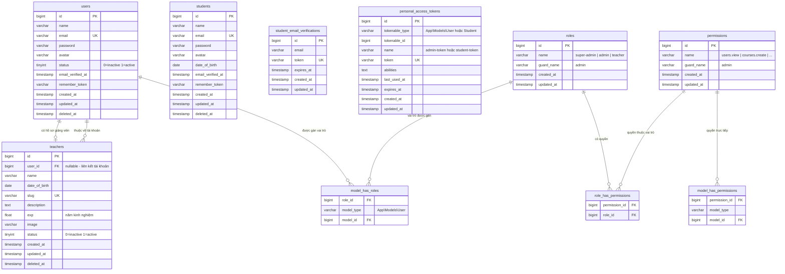
```

- [ ] **Bước 2: Commit**

```bash
git add docs/diagrams/erd-auth.md
git commit -m "docs: add ERD for auth and users domain"
```

---

## Task 3: ERD — Course & Learning Domain

**Files:**
- Create: `docs/diagrams/erd-course-learning.md`

**Bảng trong domain này:** `teachers` (stub), `students` (stub), `courses`, `categories`, `categories_courses`, `students_course`, `sections`, `lessons`, `lesson_progress`, `media_files`

- [ ] **Bước 1: Tạo file `docs/diagrams/erd-course-learning.md`**

```markdown
# ERD — Course & Learning Domain

Bao gồm: courses, categories (nested set), sections, lessons, tiến độ học tập, media files.
Teachers và Students được đưa vào dưới dạng stub — xem định nghĩa đầy đủ ở [erd-auth.md](./erd-auth.md).

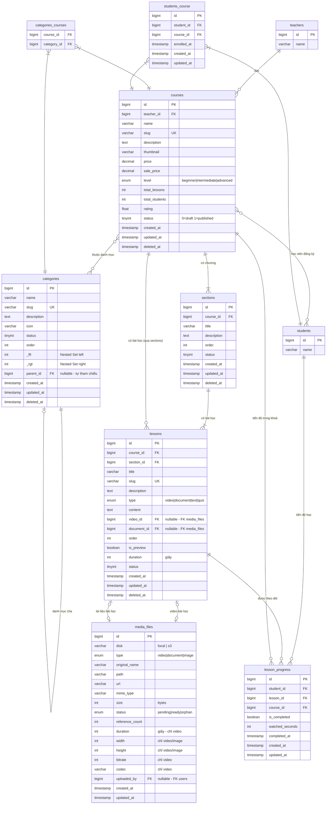
```

- [ ] **Bước 2: Commit**

```bash
git add docs/diagrams/erd-course-learning.md
git commit -m "docs: add ERD for course and learning domain"
```

---

## Task 4: ERD — Quiz Domain

**Files:**
- Create: `docs/diagrams/erd-quiz.md`

**Bảng trong domain này:** `lessons` (stub), `students` (stub), `quizzes`, `quiz_questions`, `quiz_attempts`, `quiz_generation_jobs`

- [ ] **Bước 1: Tạo file `docs/diagrams/erd-quiz.md`**

```markdown
# ERD — Quiz Domain

Bao gồm: quizzes gắn với lessons, câu hỏi trắc nghiệm, lịch sử làm bài, job AI tạo câu hỏi tự động.

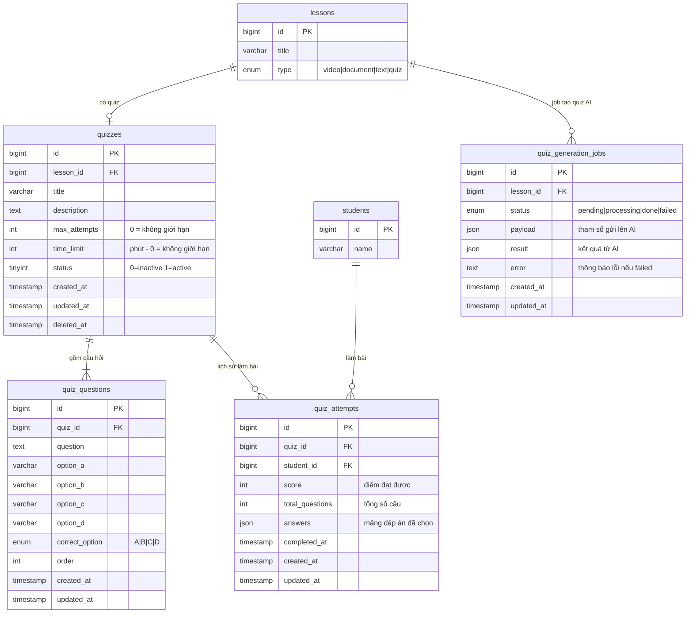
```

- [ ] **Bước 2: Commit**

```bash
git add docs/diagrams/erd-quiz.md
git commit -m "docs: add ERD for quiz domain"
```

---

## Task 5: ERD — Payment Domain

**Files:**
- Create: `docs/diagrams/erd-payment.md`

**Bảng trong domain này:** `students` (stub), `courses` (stub), `orders`, `order_items`, `transactions`, `coupons`

- [ ] **Bước 1: Tạo file `docs/diagrams/erd-payment.md`**

```markdown
# ERD — Payment Domain

Bao gồm: đơn hàng, chi tiết đơn hàng, giao dịch VNPAY, mã giảm giá.

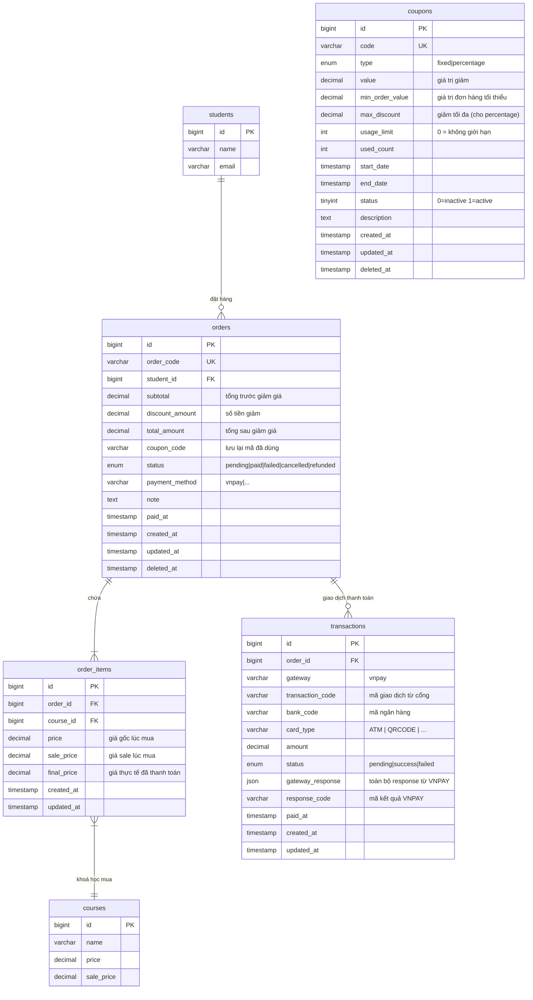
```

- [ ] **Bước 2: Commit**

```bash
git add docs/diagrams/erd-payment.md
git commit -m "docs: add ERD for payment domain"
```

---

## Task 6: ERD — Content/Posts Domain

**Files:**
- Create: `docs/diagrams/erd-content.md`

**Bảng trong domain này:** `users` (stub), `students` (stub), `posts`, `post_categories`, `tags`, `post_tag`, `post_comments`

- [ ] **Bước 1: Tạo file `docs/diagrams/erd-content.md`**

```markdown
# ERD — Content & Posts Domain

Bao gồm: bài viết blog, danh mục bài viết, tags, bình luận (threaded).

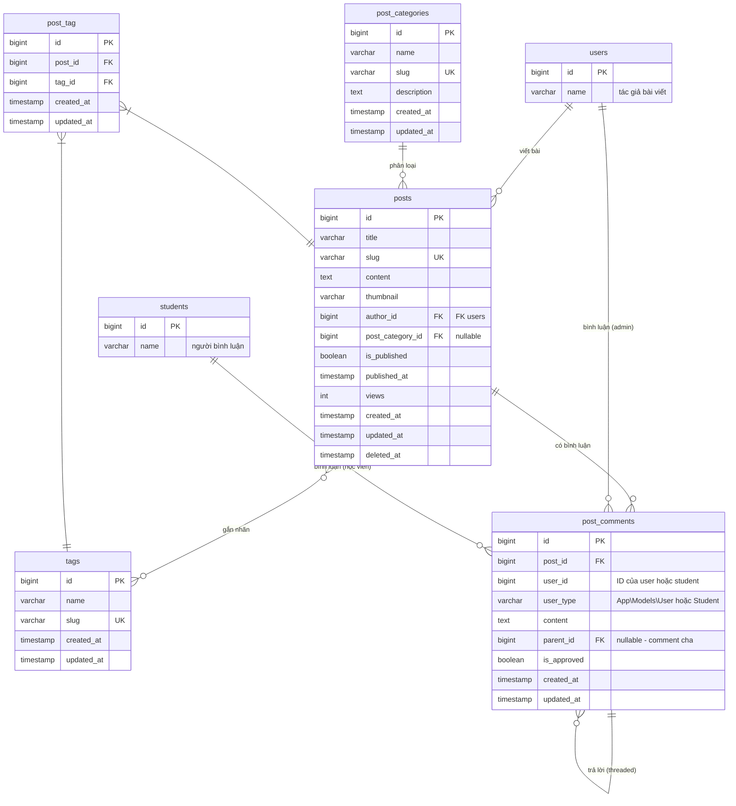
```

- [ ] **Bước 2: Commit**

```bash
git add docs/diagrams/erd-content.md
git commit -m "docs: add ERD for content and posts domain"
```

---

## Task 7: ERD — Full Combined

**Files:**
- Create: `docs/diagrams/erd-full.md`

- [ ] **Bước 1: Tạo file `docs/diagrams/erd-full.md`**

```markdown
# ERD — Full System (Toàn bộ hệ thống)

> Gợi ý: Mở bằng [mermaid.live](https://mermaid.live) để zoom/export. Diagram này lớn — dùng các file domain riêng để dễ đọc hơn.

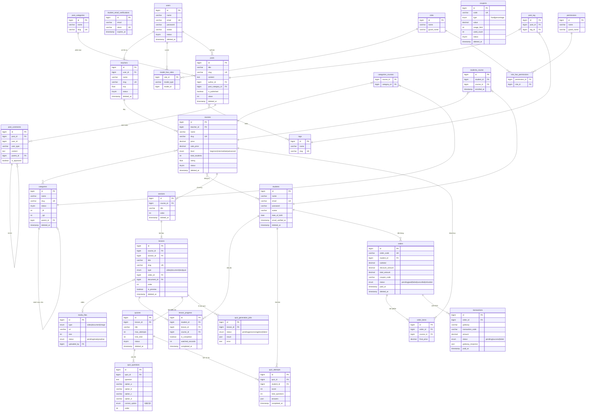
```

- [ ] **Bước 2: Commit**

```bash
git add docs/diagrams/erd-full.md
git commit -m "docs: add full combined ERD for entire system"
```

---

## Task 8: Class Diagram — Auth & Users Domain

**Files:**
- Create: `docs/diagrams/class-auth.md`

- [ ] **Bước 1: Tạo file `docs/diagrams/class-auth.md`**

```markdown
# Sơ đồ Lớp — Auth & Users Domain

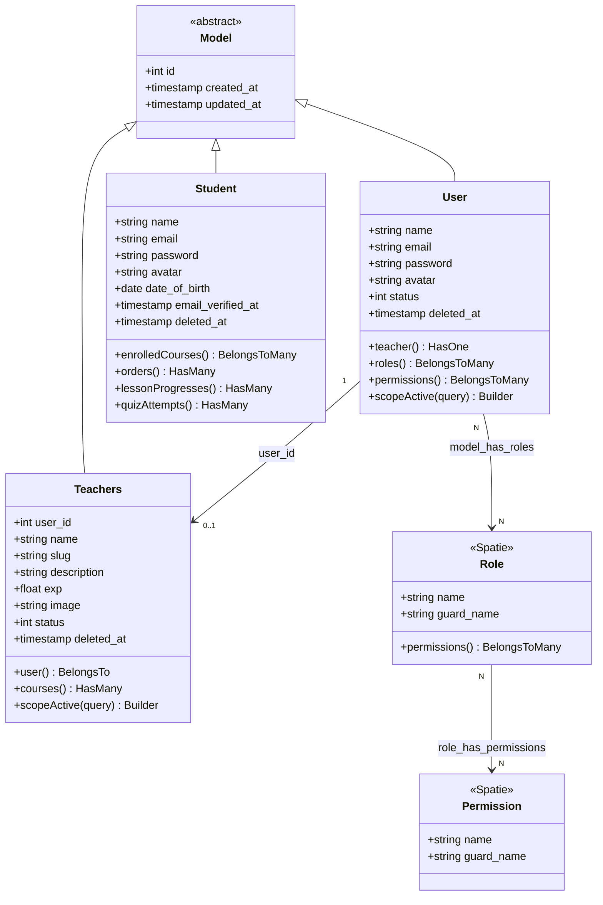
```

- [ ] **Bước 2: Commit**

```bash
git add docs/diagrams/class-auth.md
git commit -m "docs: add class diagram for auth and users domain"
```

---

## Task 9: Class Diagram — Course & Learning Domain

**Files:**
- Create: `docs/diagrams/class-course-learning.md`

- [ ] **Bước 1: Tạo file `docs/diagrams/class-course-learning.md`**

```markdown
# Sơ đồ Lớp — Course & Learning Domain

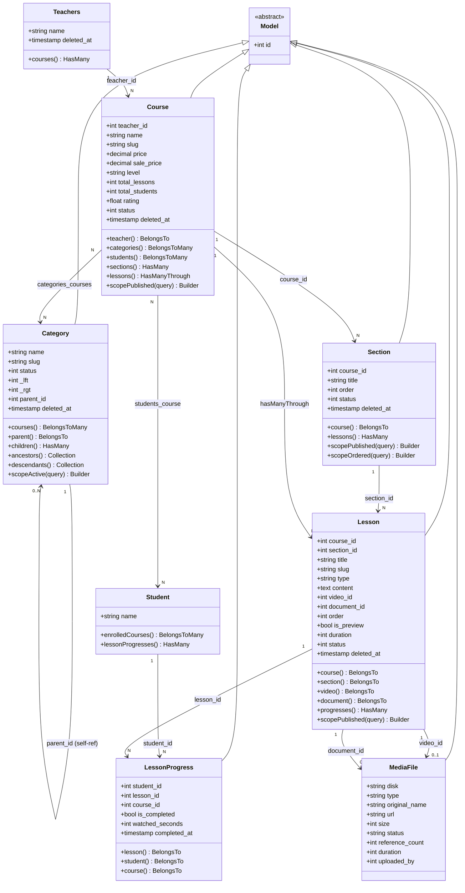
```

- [ ] **Bước 2: Commit**

```bash
git add docs/diagrams/class-course-learning.md
git commit -m "docs: add class diagram for course and learning domain"
```

---

## Task 10: Class Diagram — Quiz Domain

**Files:**
- Create: `docs/diagrams/class-quiz.md`

- [ ] **Bước 1: Tạo file `docs/diagrams/class-quiz.md`**

```markdown
# Sơ đồ Lớp — Quiz Domain

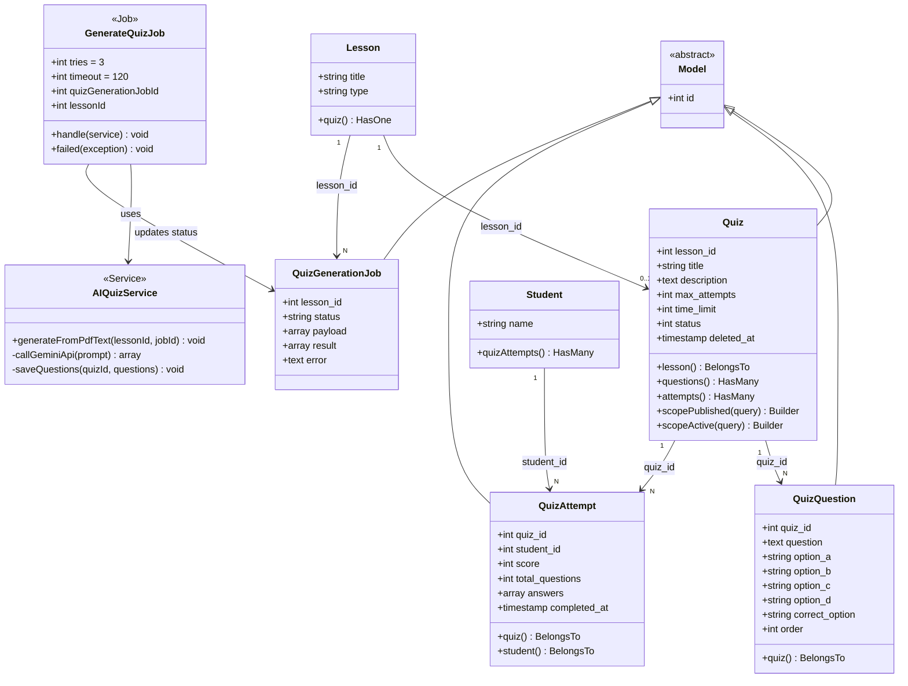
```

- [ ] **Bước 2: Commit**

```bash
git add docs/diagrams/class-quiz.md
git commit -m "docs: add class diagram for quiz domain"
```

---

## Task 11: Class Diagram — Payment Domain

**Files:**
- Create: `docs/diagrams/class-payment.md`

- [ ] **Bước 1: Tạo file `docs/diagrams/class-payment.md`**

```markdown
# Sơ đồ Lớp — Payment Domain

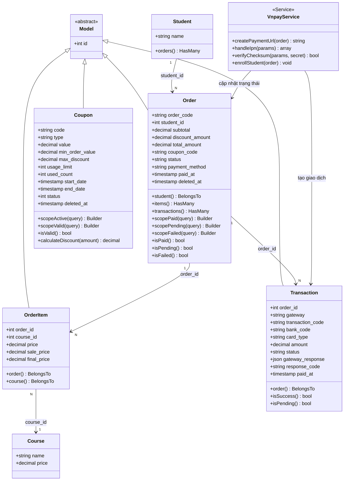
```

- [ ] **Bước 2: Commit**

```bash
git add docs/diagrams/class-payment.md
git commit -m "docs: add class diagram for payment domain"
```

---

## Task 12: Class Diagram — Content/Posts Domain

**Files:**
- Create: `docs/diagrams/class-content.md`

- [ ] **Bước 1: Tạo file `docs/diagrams/class-content.md`**

```markdown
# Sơ đồ Lớp — Content & Posts Domain

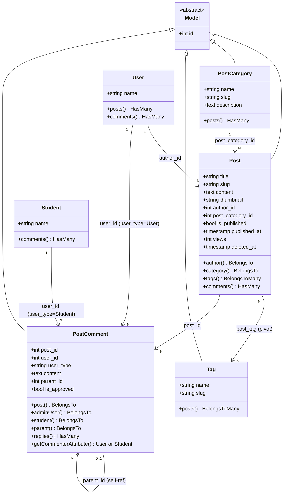
```

- [ ] **Bước 2: Commit**

```bash
git add docs/diagrams/class-content.md
git commit -m "docs: add class diagram for content and posts domain"
```

---

## Task 13: Class Diagram — Full Combined

**Files:**
- Create: `docs/diagrams/class-full.md`

- [ ] **Bước 1: Tạo file `docs/diagrams/class-full.md`**

```markdown
# Sơ đồ Lớp — Toàn bộ hệ thống

> Diagram tổng hợp. Khuyến nghị: xem từng domain riêng để dễ đọc hơn.
> Export: dán code vào [mermaid.live](https://mermaid.live) → Download SVG

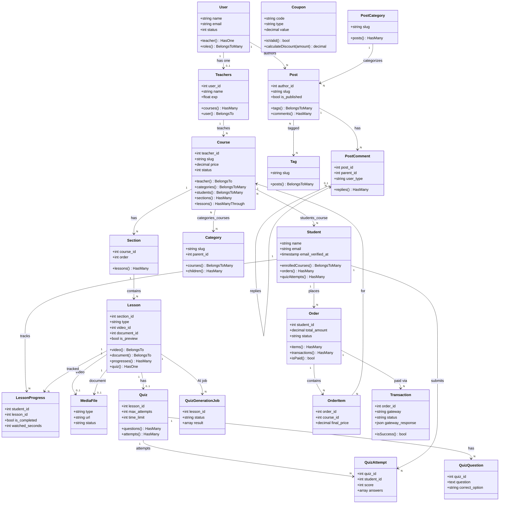
```

- [ ] **Bước 2: Commit cuối**

```bash
git add docs/diagrams/class-full.md
git commit -m "docs: add full combined class diagram for entire system"
```

---

## Self-Review

### Spec coverage check

| Yêu cầu | Task thực hiện |
|---------|---------------|
| ERD Auth domain | Task 2 |
| ERD Course/Learning domain | Task 3 |
| ERD Quiz domain | Task 4 |
| ERD Payment domain | Task 5 |
| ERD Content domain | Task 6 |
| ERD Full combined | Task 7 |
| Class Diagram Auth domain | Task 8 |
| Class Diagram Course/Learning | Task 9 |
| Class Diagram Quiz | Task 10 |
| Class Diagram Payment | Task 11 |
| Class Diagram Content | Task 12 |
| Class Diagram Full combined | Task 13 |
| Index/README | Task 1 |

Tất cả 21 bảng đều được bao phủ trong các ERD domain. Tất cả 21 Eloquent model đều xuất hiện trong các class diagram domain tương ứng.

### Placeholder scan

Không có placeholder — toàn bộ Mermaid code được viết đầy đủ trong từng task.

### Type consistency

- Tất cả relationship method names (BelongsTo, HasMany, BelongsToMany, HasManyThrough, HasOne) nhất quán giữa domain diagrams và full diagram.
- FK column names (teacher_id, course_id, section_id, v.v.) nhất quán với migrations.
- Enum values (level, status, type) khớp với migrations.

---

## Ghi chú kỹ thuật

- **teachers.user_id**: được thêm qua migration riêng `database/migrations/2026_05_04_081210_add_user_id_to_teachers_table.php` (nullable, onDelete set null)
- **post_comments.user_id**: là polymorphic-style (không dùng morph, dùng user_type string thủ công) — có thể là User hoặc Student
- **lesson_progress**: unique constraint trên (student_id, lesson_id) — upsert khi cập nhật tiến độ
- **categories**: dùng Kalnoy NestedSet — _lft, _rft là internal fields, không nên expose trong API
- **Spatie RBAC**: chỉ áp dụng cho guard `admin` (User model), không áp dụng cho Students
